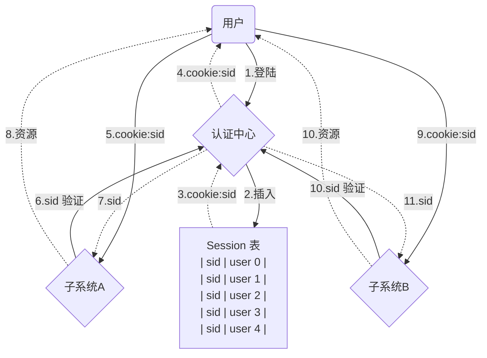
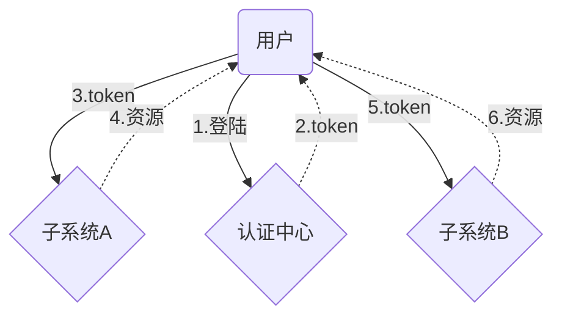
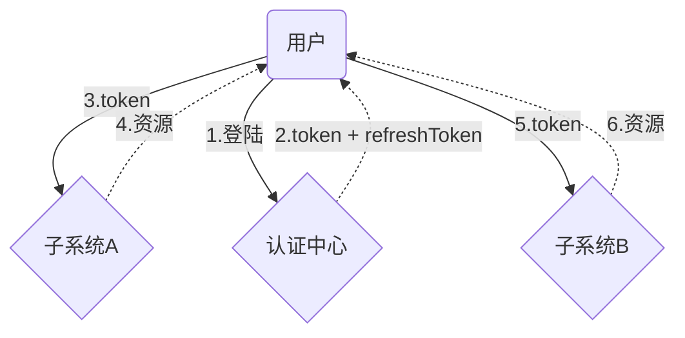
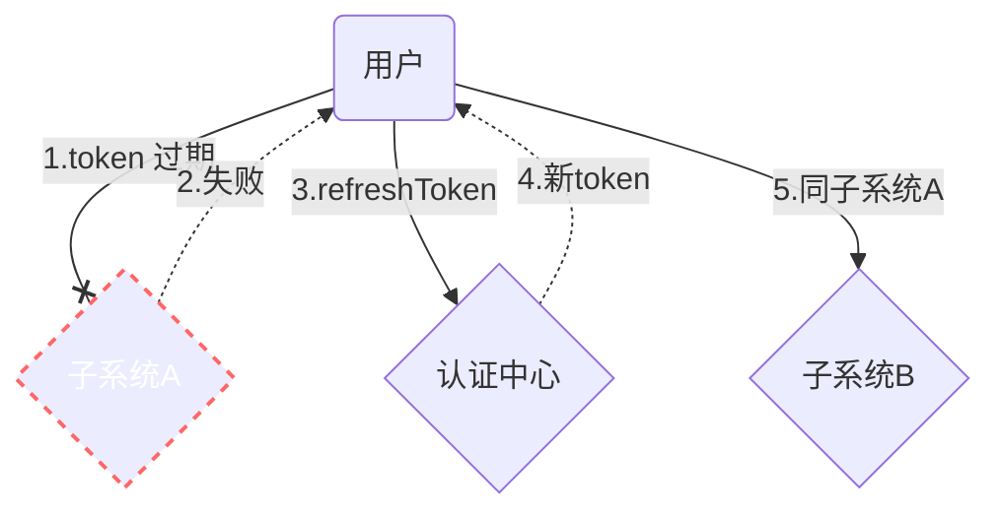

# 基于单点登录的中后台管理系统权限相关控制

演示项目采用 vue 2.x vue-router 3.x  
[代码地址：https://github.com/heyuming1118/vue2-admin-app](https://github.com/heyuming1118/vue2-admin-app)

## 单点登陆
单点登录英文全称Single Sign On，简称SSO。
指在多系统应用群中登录一个系统，便可在其他所有系统中得到授权而无需再次登录，包括单点登录与单点注销两部分
###  session + cookie 模式

> session + cookie 模式 一般用于大型项目。
> 主要优点是可以通过session列表快速对用户做出控制
> 缺点也很明显，如果其中一个子系统访问量特别大，频繁访问认证中心，认证中心就需要跟着扩容，同时还要做session集群。哪怕其他的认证中心没有那么大的访问量。同时如果认证中心崩了，所有的子系统也会访问不了

###  token 模式

> token 模式就是仅仅将登陆系统抽离出来，前端将token保存在本地。可以解决用户登录一次，切换其他系统时免登录操作。但是无法对用户做任何控制，在token 过期前，无法拒绝用户登录

### 双token模式




> 双token模式,由于token的过期时间非常短，所以每经过一段时间，就要去认证中心重新认证。
> 虽然无法控制用户立即下线，但是可以在最近一次认证让他下线。
> 这种模式也可以实现用户无感刷新

## 权限控制

对于管理系统来说，权限一般分为 `系统权限控制`，`页面权限控制`，`按钮权限控制`，`数据权限控制`
`数据权限控制`一般在是在后端控制的
前端主要是针对前三者，对相关页面拦截，对相关按钮隐藏


### 系统权限

 在单点登录模式下，子系统没有自己的登录模块。
 用户登录完成后，后端会暴露两个接口地址 */getuser*（获取用户信息） */logout*（退出登录）。
 因此，在判断系统权限时，只需要在`合适的时机`，调用获取用户信息的接口得到数据即可，获取到数据即有当前系统权限，否则，调用*/logout*直接退出

- 什么是合适的时机？
> 不是 App.vue 中。 也不是 beforeEach 中。
>
> 现在市面上开源的框架一般都是在 new Vue() 之前，也就是程序运行之前。
> 因为如果程序开始运行，就会有部分页面开始渲染。而获取用户信息是需要时间的，等获取到结果后再去判断权限跳转登出或者403页面，这样的体验不是很好

- 可以将new Vue() 操作，放入一个函数中，等待所有权限全部就位之后，再开始运行。就像这样
  ```js
  function setup({ user, token, menu }) {
    store.dispatch('user/setUser', user)
    store.dispatch('user/setToken', token)
    store.dispatch('user/setRole', getRoles(1))
    store.dispatch('app/setmenus', menu)
  
    const app = new Vue({
      router,
      store,
      render: h => h(App)
    })
  
    app.$mount('#app')
  }
  ```

> okay! 现在vue渲染工作就可以挂起，等待调用。在这之前，我们先去获取到用户信息
在 `src/api/sys.js`中，准备好了 `getUser`接口，模拟后端返回数据。
准备一个`auth`工具函数，将获取用户信息，获取菜单等接口全部放入进去，这个方法我放在 `src/lib/auth.js`中
  ```js
  import { getUser, getMenu } from '@/api/sys'
  
  export async function auth() {
      // 获取用户信息
      const user = await getUser()
      // 获取用户权限菜单
      const menu = await getMenu()
  
      return {
          user: user.user,
          token: user.token,
          menu
      }
  }
  ```
现在只需要将两个方法在`main.js`分别调用即可
  ```js
  auth().then(setup)
  ```
这样就可以确保程序运行时，是一定有权限了
  
> 这里有两个问题不得考虑：
> 1.`auth`执行时需要时间的，而这段时间内因为app没有渲染挂载，页面是一直白屏的。
> 2.调用接口有可能会报错，报错了应该如何处理？

  


