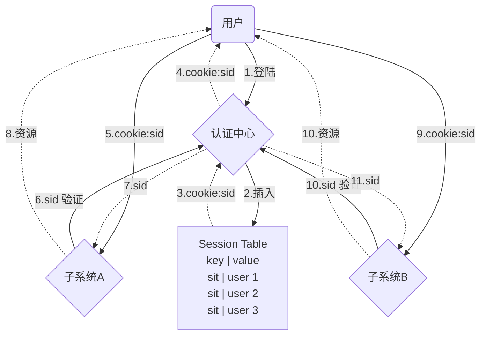
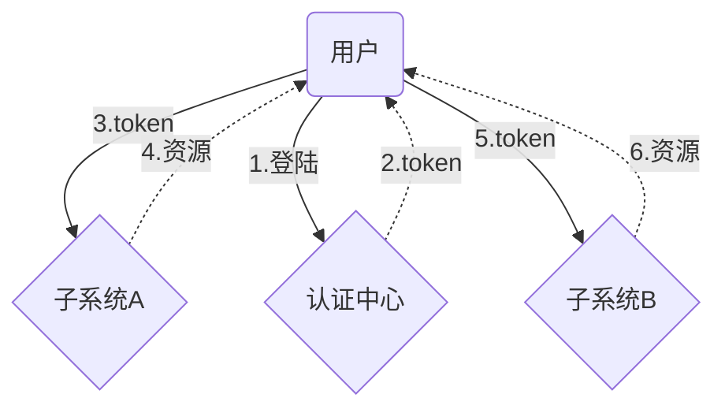
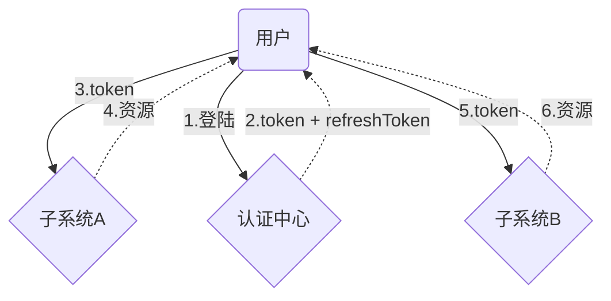
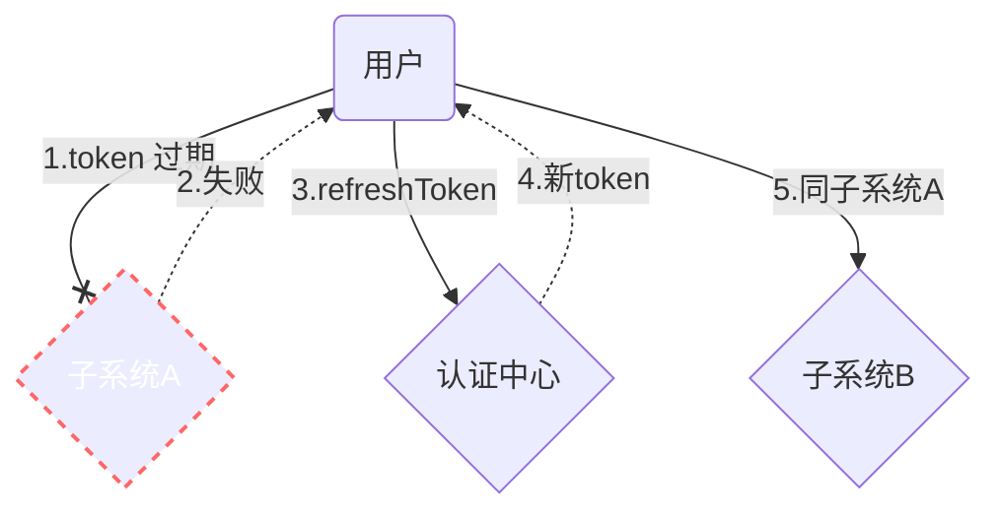

# 基于单点登录的中后台管理系统权限相关控制

演示项目采用 vue 2.x vue-router 3.x  
[代码地址：https://github.com/heyuming1118/vue2-admin-app](https://github.com/heyuming1118/vue2-admin-app)

## 单点登陆
单点登录英文全称Single Sign On，简称SSO。
指在多系统应用群中登录一个系统，便可在其他所有系统中得到授权而无需再次登录，包括单点登录与单点注销两部分
###  session + cookie 模式

> session + cookie 模式 一般用于大型项目。
> 主要优点是可以通过session列表快速对用户做出控制
> 缺点也很明显，如果其中一个子系统访问量特别大，频繁访问认证中心，认证中心就需要跟着扩容，同时还要做session集群。哪怕其他的认证中心没有那么大的访问量。同时如果认证中心崩了，所有的子系统也会访问不了

###  token 模式

> token 模式就是仅仅将登陆系统抽离出来，前端将token保存在本地。可以解决用户登录一次，切换其他系统时免登录操作。但是无法对用户做任何控制，在token 过期前，无法拒绝用户登录

### 双token模式




> 双token模式,由于token的过期时间非常短，所以每经过一段时间，就要去认证中心重新认证。
> 虽然无法控制用户立即下线，但是可以在最近一次认证让他下线。
> 这种模式也可以实现用户无感刷新

## 权限控制

对于管理系统来说，权限一般分为 `系统权限控制`，`页面权限控制`，`按钮权限控制`，`数据权限控制`
`数据权限控制`一般在是在后端控制的
前端主要是针对前三者，对相关页面拦截，对相关按钮隐藏


### 系统权限

 在单点登录模式下，子系统没有自己的登录模块。
 用户登录完成后，后端会暴露两个接口地址 */getuser*（获取用户信息） */logout*（退出登录）。
 因此，在判断系统权限时，只需要在`合适的时机`，调用获取用户信息的接口得到数据即可，获取到数据即有当前系统权限，否则，调用*/logout*直接退出

- 什么是合适的时机？
> 不是 App.vue 中。 也不是 beforeEach 中。
>
> 现在市面上开源的框架一般都是在 new Vue() 之前，也就是程序运行之前。
> 因为如果程序开始运行，就会有部分页面开始渲染。而获取用户信息是需要时间的，等获取到结果后再去判断权限跳转登出或者403页面，这样的体验不是很好

可以将new Vue() 操作，放入一个函数中，等待所有权限全部就位之后，再开始运行。就像这样
  ```js
  function setup({ user, token, menu }) {
    store.dispatch('user/setUser', user)
    store.dispatch('user/setToken', token)
    store.dispatch('user/setRole', getRoles(1))
    store.dispatch('app/setmenus', menu)
  
    const app = new Vue({
      router,
      store,
      render: h => h(App)
    })
  
    app.$mount('#app')
  }
  ```

> okay! 现在vue渲染工作就可以挂起，等待调用。在这之前，我们先去获取到用户信息
在 `src/api/sys.js`中，准备好了 `getUser`接口，模拟后端返回数据。
准备一个`auth`工具函数，将获取用户信息，获取菜单等接口全部放入进去，这个方法我放在 `src/lib/auth.js`中
  ```js
  import { getUser, getMenu } from '@/api/sys'
  
  export async function auth() {
      // 获取用户信息
      const user = await getUser()
      // 获取用户权限菜单
      const menu = await getMenu()
  
      return {
          user: user.user,
          token: user.token,
          menu
      }
  }
  ```
现在只需要将两个方法在`main.js`分别调用即可
  ```js
  auth().then(setup)
  ```
这样就可以确保程序运行时，是一定有权限了
  
 这里有两个问题不得考虑：
 1.`auth`执行时需要时间的，而这段时间内因为app没有渲染挂载，页面是一直白屏的。
 2.调用接口有可能会报错，报错了应该如何处理？

 先来解决第一个问题。
 首先是在`auth`中尽量减少接口调用，只拿必要的信息，比如用户信息，页面权限
 第二是在白屏是开启loading动画等待，loading动画写在 `/public/index.html`中,相关的样式，也要预先写在 `/public/css`下
 
 ```html
  <div id="app">
    <div id="loading" class="base-loading">
      images/loading.png" />
    </div>
  </div>
```

> 这里的逻辑，可以不用额外处理， `app.$mount` 时会将这里面的内容替换掉

第二个问题，解决获取用户信息报错
这里的逻辑需根据业务来确认，一般来说，可以做一个错误页面，给用户提供两个选择：重新获取，推出登录。这个页面也需要提前写到`/public/index.html`中
 ```html
  <div id="app">
    <div id="error" class="errmsg" style="display: none">
     images/error.png" alt="" />
     <div id="errmsg-text" class="errmsg-text">刷新后尝试获取数据</div>
     <button id="errmsg-shuaXin" class="btn btn--primary is-plain">刷新</button>
     <button id="errmsg-tuiChu" class="btn btn--primary">退出</button>
   </div>
  </div>
```
按钮操作逻辑我放在`/src/lib/portal.js`中
在 `main.js` 中去捕获错误
```js
import { onAppErrorBoundary } from './lib/portal'
try {
  auth().then(setup)
} catch (error) {
  onAppErrorBoundary(error)
}
```

### 页面权限
一般进入页面有两种方式：通过菜单点击进入，直接在地址栏输入url进入。
针对这两种方式处理起来也有不同，一是没有权限的页面不生成菜单，用户无法通过点击进入，二是在路由守卫 `beforeEach`中拦截

大部分后台系统都会做菜单管理页面，方便IT人员管理菜单
在`/src/api/sys.mock.js`中模拟了一下后端根据权限返回的菜单数据，有返回，代表就是有该页面权限。并且在 `main.js`中存放到 *vuex*中

- 根据数据生成菜单。主要关注 `/src/Layout`中的侧边栏组件,这里用的是el的aside组件

```vue
<!--src/Layout/components/AppAside.vue-->
<template>
  <el-aside width="200px" class="app-aside">
    <el-menu :default-active="$route.path" @select="handleSelect">
      <AppAsideMenuList :menuList="menus"></AppAsideMenuList>
    </el-menu>
  </el-aside>
</template>

<script>
import { httpReq } from "@/utils/constants";
import { mapGetters } from "vuex";

import AppAsideMenuList from "./AppAsideMenuList.vue";
export default {
  name: "AppAside",

  components: {
    AppAsideMenuList,
  },

  computed: {
    ...mapGetters("app", ["menus"]),
  },

  methods: {
    handleSelect(path) {
      if (httpReq.test(path)) {
        return window.open(path);
      }
      this.$router.push(path);
    },
  },
};
</script>
```
- 菜单一般是一个树形结构，子组件可以单独封装成递归组件 *这里没有很复杂的交互逻辑,做成函数组件可以优化性能*

```vue
<script>
export default {
  name: "AppAsideMenuList",
  functional: true,
  render(h, { props }) {
    const { menuList } = props;
    const el = menuList.map((item) => {
      // 如果有子级
      if (item.children && item.children.length) {
        const child = [];
        item.icon && child.push(h("i", { class: item.icon }));
        child.push(h("span", item.title));

        return h(
          "el-submenu",
          { props: { index: item.id, key: item.id } },
          [
            h("span", { slot: "title" }, child),
            // 递归组件
            h("AppAsideMenuList", { props: { menuList: item.children } }),
          ]
        );
      } else {
        const child = [];
        item.icon && child.push(h("i", { class: item.icon }));
        child.push(h("span", { slot: "title" }, item.title));

        return h(
          "el-menu-item",
          { props: { index: item.path, key: item.id } },
          child
        );
      }
    });
    return el;
  },
};
</script>
```
- 路由守卫拦截
路由拦截有两种做法

比较激进的,完全根据权限数据生成路由。
这样的做法好处是,无须路由拦截,没有权限,就没有该路由,也不开发人员在routes中定义路由。
这需要菜单管理页面考虑更细致，路由所需字段全部在页面中可配置，需要和开发人员约定好页面目录结构。

这里主要关注 `main2.js``router/index2.js`的做法

```js
// main2.js
import { getRouter } from './router/index2.js'

const app = new Vue({
  router: getRouter(menu),//动态生成路由
  store,
  render: h => h(App)
})
```
[进入**router/index2.js**](./src/router/index2.js)

也可以采用传统做法，也是现在主流做法
在 `router/routes`文件夹下定义好所有路由，根据数据权限生成权限列表，然后再路由守卫进行拦截

这里主要关注`main.js``router/index.js`和`store/modules/app.js`的做法
```js
//store/modules/app.js
//在vuex中保存一个路由权限映射表
SET_PERMISSION_MEUN(state,data = []){
   const permissionMenu = {}
   const findTreeNode = (data)=>{
       data.forEach(item=>{
           if(!item.children || !item.children.length){
               //赋值一个空对象，如果需要可以保存一些信息
               permissionMenu[item.path] = {}
           }else{
               findTreeNode(item.children)
           }
       })
   }
   findTreeNode(data)
   state.permissionMenu = permissionMenu
}
```
```js
// router/index.js
import Vue from 'vue'
import VueRouter from 'vue-router'
import store from '@/store'

Vue.use(VueRouter)

// 读取 routes 下所有文件
const routeFile = require.context('./routes', true, /\.js/)
const routes = [
    ...routeFile.keys().reduce((routes, file) => routes.concat(routeFile(file).default), []),
    {
        path: '/error/:code',
        name: 'ErrorPage',
        component: () => import('@/views/error'),
        meta: {
            title: '出错啦！'
        }
    },
    {
        path: '*',
        redirect: '/error/404'
    },
]
const router = new VueRouter({
    routes,
    scrollBehavior(to, from, savedPosition) {
        if (savedPosition) return savedPosition
        // 始终滚动到顶部
        return { y: 0 }
    },
})

router.beforeEach((to, from, next) => {
    // if (to.meta.roles && to.meta.roles.length) {
    //     if (!to.meta.roles.includes(store.state.user.role)) {
    //         return next('/error/403')
    //     }
    // }
    // 错误页面直接放行
    if (to.path.includes('error')) return next()
    // 拦截不在权限列表中的页面
    if (!(to.path in store.state.app.permissionMenu)) return next('/error/403')
    next()
})

router.afterEach((to, from) => {
    document.title = to.meta.title || 'admin'
})

export default router
```

### 按钮权限

- 按钮权限主流一般有两种做法
- vue自定义指令：使用指令传入权限规则，没有权限则从父节点中删除该元素 
- 函数式组件：通过props传入权限规则，没有权限则不渲染该节点


  
  


