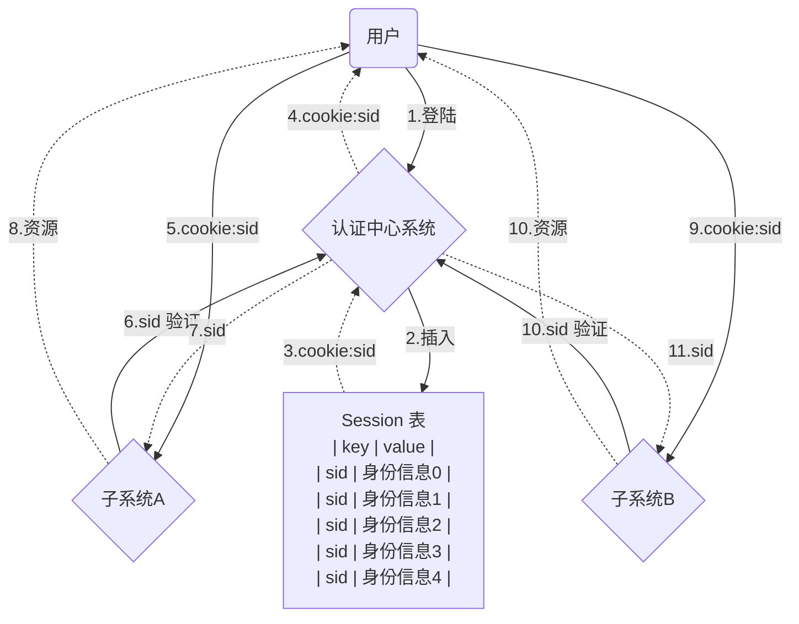

# 基于单点登录的中后台管理系统权限相关控制

> 演示项目采用 vue 2.x vue-router 3.x  
> [代码地址：https://github.com/heyuming1118/vue2-admin-app](https://github.com/heyuming1118/vue2-admin-app)

## 单点登陆
###  session + token 模式

```mermaid
graph TB
A(用户) --> |1.登陆| B{认证中心系统}
C -.-> |3.cookie:sid| B      
B -.-> |4.cookie:sid| A     
A --> |5.cookie:sid| D{子系统A}
D --> |6.sid 验证| B      
B -.-> |7.sid| D      
D -.-> |8.资源| A      
A --> |9.cookie:sid| E{子系统B}
E --> |10.sid 验证| B
B -.-> |11.sid| E
E -.-> |10.资源| A
B --> |2.插入| C["Session 表
| key | value | 
| sid | 身份信息0 | 
| sid | 身份信息1 | 
| sid | 身份信息2 | 
| sid | 身份信息3 | 
| sid | 身份信息4 | "] 
```

